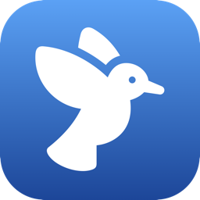
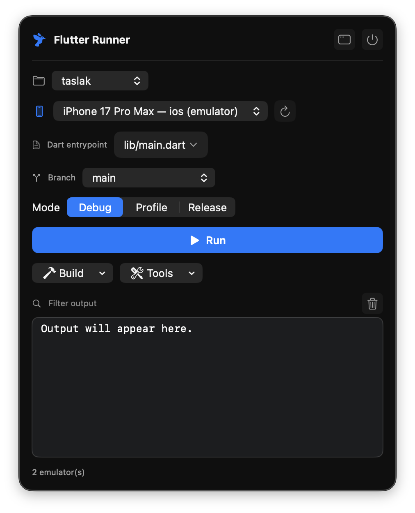
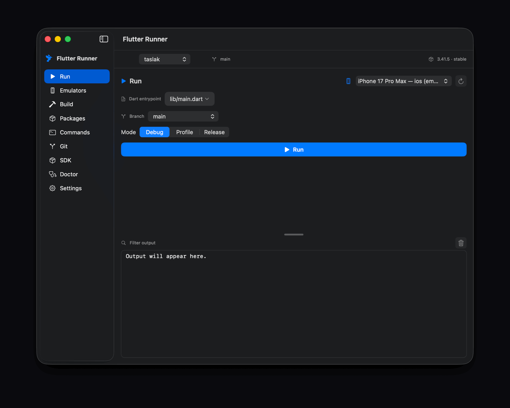

<div align="center">



# Flutter GUI Runner

### The Flutter run / build / device panel for editors that don't have one.

For developers — and **AI coding agents** — who live in Zed, Neovim, Helix,
Sublime, or a plain terminal.

[](https://github.com/huseyiniriss/flutter-gui-runner/releases)
[]()
[](LICENSE)
[](https://github.com/huseyiniriss/flutter-gui-runner/releases/latest)

<br/>



*Always-on menu-bar panel — pick a device, Run, Hot reload, Build, all without leaving your editor.*

</div>

---

## Why this exists

If you write Flutter outside Android Studio / VS Code, you get great LSP
autocomplete — but **none of the run/device/build UI**. You're left memorizing
`flutter` flags and pasting device IDs by hand.

It's worse in **agentic coding**. When an agent (Claude Code, Cursor, Windsurf,
Aider…) is editing your Flutter project, *you* still have to drive the device
side: choose a target, run, hot reload, ship an AAB/IPA, manage signing. Editors
like Zed can't add that UI via extensions (no toolbar buttons, no dropdowns).

**Flutter GUI Runner is that missing half of the loop** — a small, native macOS
app that does what the Android Studio Flutter plugin does, next to *any* editor.

## A look around

<div align="center">



*Run · Emulators · Build · Packages · Commands · Git · SDK · Doctor · Settings*

</div>

## Features

- 🐦 **Menu-bar quick panel** — device picker, Run/Stop, Hot reload/restart, `--dart-define`, **DevTools**, quick Build & Tools, live log. Never leave your editor.
- ▶️ **Run** — any device, **debug / profile / release**, hot reload & restart (reliable via `--pid-file` + `SIGUSR1/2`, no TTY needed), inline **`--dart-define`** editor applied to both run and build.
- 🐞 **DevTools** — one click opens the running app's **Flutter DevTools** (debugger/profiler) in your browser, auto-wired to the live session.
- 📱 **Emulators** — list & launch Android AVDs and iOS simulators.
- 🔨 **Build** — APK / **AAB** / **IPA** / iOS / Web / macOS with flavor, build name/number, `--dart-define`, `--split-per-abi`, `--obfuscate`; **prefilled from `pubspec.yaml`**; reveal artifact in Finder.
- 🔐 **Android signing** — choose or **generate a keystore** (`keytool`) and write `android/key.properties`.
- 🧊 **Packages** — read `pubspec` deps, **add / remove / upgrade** a package, `pub outdated`.
- ⌨️ **Commands** — `pub get/upgrade/outdated`, `analyze`, `test`, `format`, `build_runner`, `gen-l10n`, `clean`.
- 📦 **SDK** — current Flutter/Dart version & channel, upgrade, switch channel; **Doctor** tab for `flutter doctor -v`.
- 📺 **Resizable terminal** — drag to size, font scales with the UI; UI zoom with `⌘ +/−`.
- ⚙️ **FVM-aware** & **per-project memory** — uses `fvm flutter` when pinned; remembers device/mode/build options across restarts.
- 🧩 **Zero lock-in** — runs the exact `flutter` commands a terminal would (login shell), so behavior matches your CLI. No telemetry.

## How it compares

|  | Flutter GUI Runner | Android Studio / VS Code | Raw `flutter` CLI |
|---|:---:|:---:|:---:|
| Works alongside any editor / AI agent | ✅ | ❌ (IDE-bound) | ✅ |
| Clickable device picker & run/hot-reload | ✅ | ✅ | ❌ |
| One-click AAB/IPA + signing | ✅ | ✅ | ❌ (flags) |
| Lightweight (native, ~1 MB) | ✅ | ❌ (heavy) | ✅ |
| Always-on menu bar | ✅ | ❌ | ❌ |

## Install

> ⚠️ Not notarized yet (open-source, unsigned). Gatekeeper warns on first launch.

1. Download `FlutterGUIRunner.dmg` from [**Releases**](https://github.com/huseyiniriss/flutter-gui-runner/releases/latest).
2. Drag **Flutter Runner** to `Applications`.
3. First launch only: **right-click → Open → Open**.

Needs a working **Flutter SDK** on `PATH` (or set it in Settings).

## Quick start

1. Pick your project (auto-discovered under `~/Documents/projects`, or add a folder).
2. Choose a device → **Run**. Save a file in your editor, hit **Hot reload**.
3. Need a release? **Build → AAB/IPA**. Need a keystore? **Build → Android Signing → Generate**.
4. Keep the menu-bar 🐦 panel open while you (or your agent) code.

## Build from source

```sh
git clone https://github.com/huseyiniriss/flutter-gui-runner.git
cd flutter-gui-runner
./build-app.sh             # → FlutterRunner.app
open ./FlutterRunner.app
./scripts/make-dmg.sh      # → dist/FlutterGUIRunner.dmg
```

Swift 6 (Xcode 16+). No third-party dependencies.

## How it works

- Commands run through a **login `zsh -lc`** in the project dir → `PATH` and the
  iOS/Android toolchains resolve exactly like your terminal.
- `flutter run` uses `--pid-file`; **hot reload/restart** are `SIGUSR1`/`SIGUSR2`.
- Log output is coalesced and rendered in an `NSTextView`, so a chatty
  `flutter run` stays smooth.

## Roadmap

See [`docs/plans`](docs/plans). Next: Developer-ID signing + **notarization**,
deeper iOS signing, multi-device run, auto-update, GitHub Actions release.

## Contributing

Issues and PRs welcome. Good first areas: notarization/CI, iOS signing,
a Linux/Windows port (the UI is macOS/SwiftUI today).

## License

[MIT](LICENSE) © huseyiniriss · Built with help from Claude.
